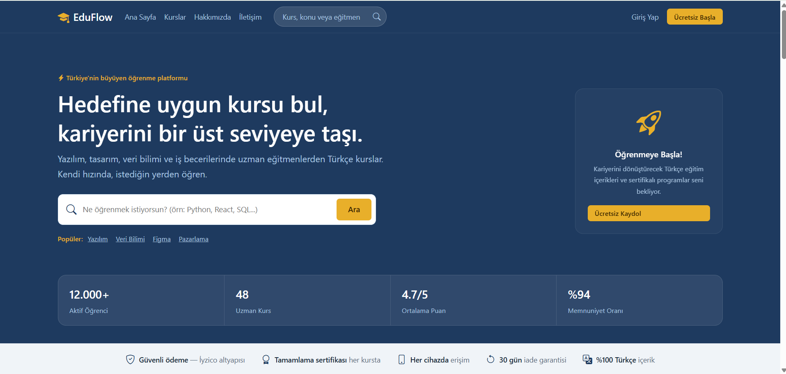
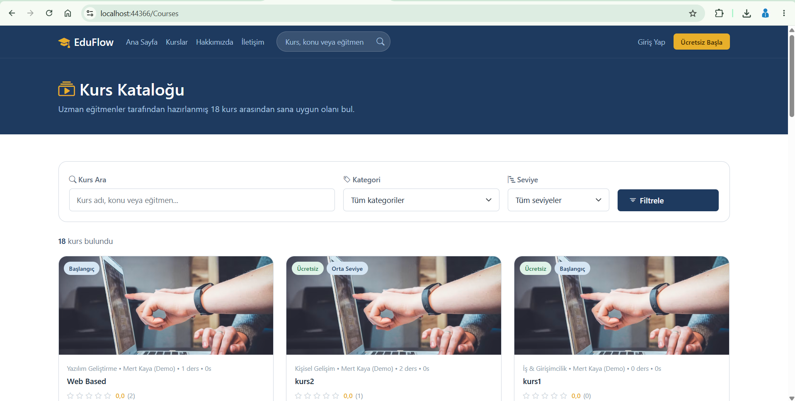
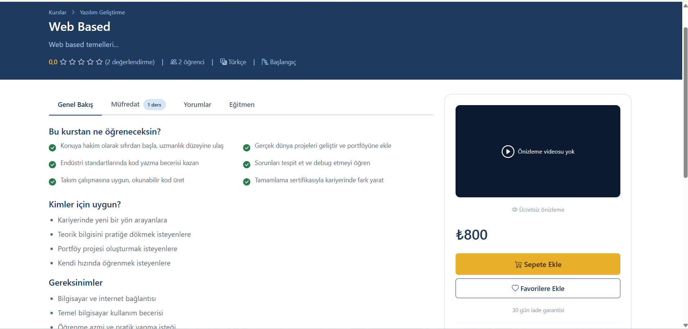
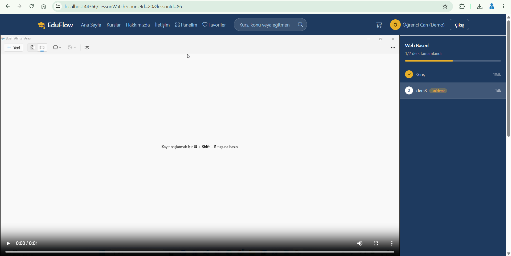
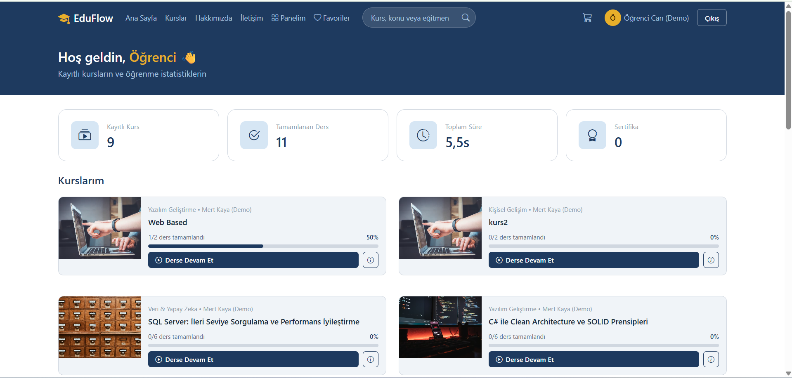
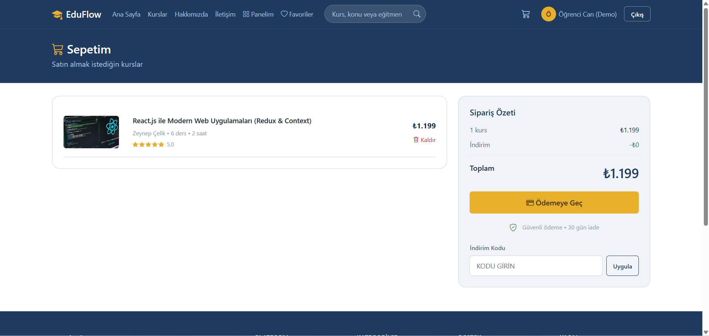
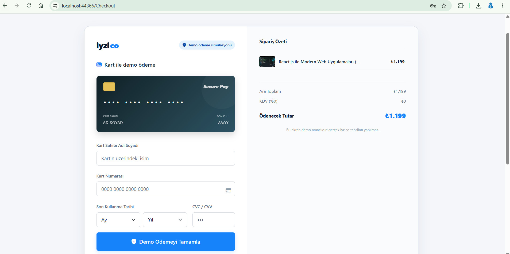
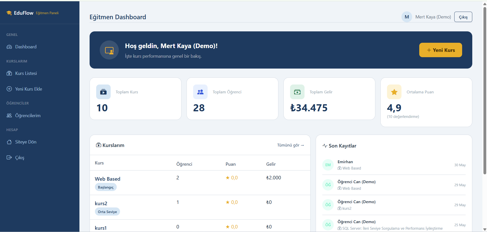
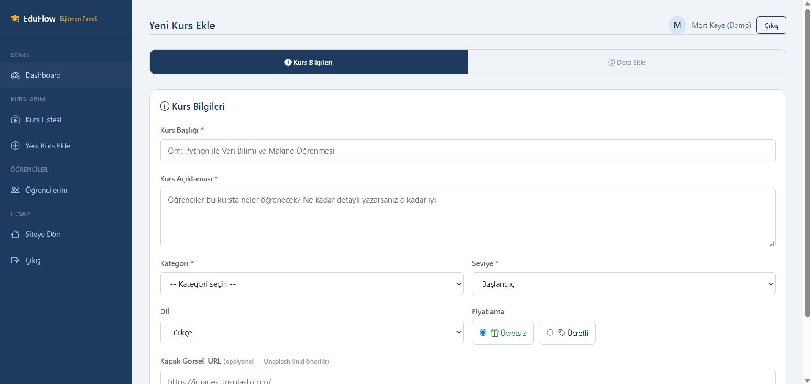
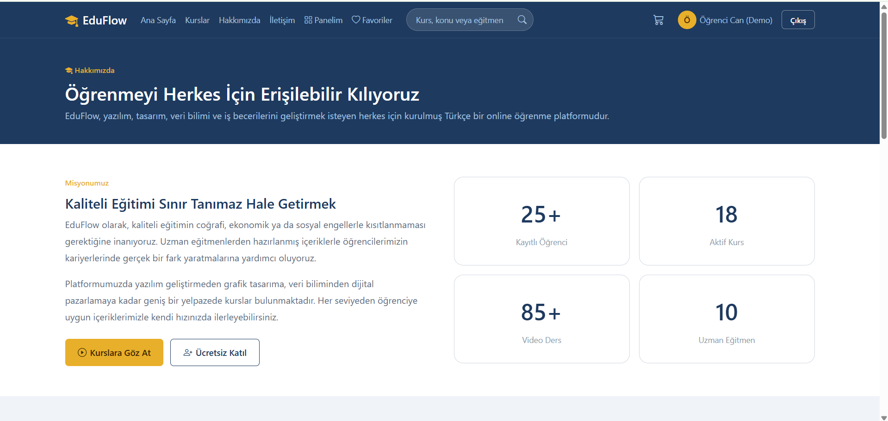

# EduFlow - Learning Management System (LMS)

EduFlow is a fully-featured, web-based Learning Management System developed as the final project for the Web-Based Technologies course. The platform connects students with expert instructors through a structured and responsive e-learning experience, covering everything from course discovery and purchase to lesson delivery and progress tracking.

---

## Screenshots

### Home Page


### Course Catalog


### Course Detail


### Lesson Watch


### Student Dashboard


### Cart & Checkout



### Instructor Panel - Dashboard


### Instructor Panel - Course Management


### Admin Panel - Dashboard


### Admin Panel - User Management


### About Page


### Contact Page


---

## Technical Stack

| Layer | Technology |
|---|---|
| Backend | C#, ASP.NET Web Forms, .NET Framework 4.7.2 |
| Data Access | ADO.NET, Microsoft SQL Server, Stored Procedures |
| Frontend | Vanilla CSS, Bootstrap 5.2, JavaScript, HTML5 |
| Icons | Bootstrap Icons 1.11 |
| Payment | Simulated iyzico 3D Secure Gateway |
| Auth | Session-based authentication with SHA-256 password hashing |

---

## Project Structure

```
EduFlow/
|-- Admin/               # Admin panel pages (Dashboard, Users, Courses, Comments, Ads)
|-- Instructor/          # Instructor panel pages (Dashboard, MyCourses, AddCourse, Students)
|-- DAL/                 # Data Access Layer (CourseDAL, UserDAL, InstructorDAL, AdDAL)
|-- Models/              # Entity classes (User, Course, Lesson, Order, Review, etc.)
|-- Services/            # SecurityService (hashing), SampleData fallback
|-- Database/            # SQL setup and seed scripts
|-- Content/             # Site.css (custom design system)
|-- Scripts/             # JavaScript libraries
|-- Uploads/             # User-uploaded course thumbnails and lesson videos
|-- Web.config           # Connection string and app settings
```

---

## Core Modules

### 1. Student Portal

**Dashboard**
- Displays all enrolled courses with individual lesson progress bars.
- Shows the last-watched lesson with a direct resume button.
- Tracks completed lessons and calculates course completion percentage.

**Course Catalog**
- Full-text search across course title, instructor name, and category.
- Filter by category, level (Beginner / Intermediate / Advanced), and price (free / paid).
- Courses rendered as cards with thumbnail, rating, enrollment count, and pricing.

**Course Detail**
- Full course description, instructor info, and curriculum breakdown.
- Buy box with real-time discount code validation.
- Approved student reviews with star ratings.
- Free course enrollment without payment.

**Lesson Watch**
- HTML5 video player with native browser controls.
- Mark lesson as complete button that updates progress in the database.
- Sidebar list of all lessons with completion indicators.

**Favorites & Order History**
- Toggle favorites on any course card; persisted per user in the database.
- Full order history with course name, amount paid, and payment reference.

**Profile**
- Update display name and profile photo.
- Change password with current password verification.

---

### 2. Instructor Portal

**Dashboard**
- Aggregated statistics: total courses, total enrolled students, total revenue, average course rating.
- Recent enrollment activity feed (last 5 student enrollments).

**Course Management (MyCourses)**
- Full list of instructor-owned courses with per-course enrollment count, revenue, and rating.
- Inline delete (soft-delete via IsActive flag).
- Lesson ordering controls (move up / move down) backed by a stored procedure.

**Add / Edit Course**
- Multi-step form: course metadata (title, description, category, level, language, price) + lesson upload.
- Video file upload for each lesson with duration and preview flag settings.
- Discount code generator: assign a unique alphanumeric code and percentage to a course.

**Student List**
- Full list of students enrolled in the instructor's courses with enrollment date.

---

### 3. Admin Panel

**Dashboard**
- Platform-wide statistics: total users, total courses, total orders, total revenue.

**User Management**
- List all registered users with role badges (Student / Instructor / Admin).
- Activate or deactivate any user account.

**Course Management**
- Read-only overview of all platform courses with instructor, category, level, rating, and enrollment data.
- Direct link to each course detail page.

**Comment Moderation**
- Pending reviews queue: approve or reject submitted student reviews.
- Approved reviews table with delete option.

**Advertisement Management**
- Create, activate/deactivate, and delete banner advertisements.
- Assign ads to positions: Header, Sidebar, or Footer.

---

### 4. Discount Code System

- Instructors generate a unique alphanumeric code tied to a specific course and a percentage value (1-99%).
- Students enter the code in the cart; the system validates it against the database and checks course eligibility.
- Valid codes render a strikethrough original price, a highlighted discount badge, and the final calculated amount.
- Only one active code per course is allowed; generating a new code replaces the previous one.

---

### 5. Simulated iyzico 3D Secure Checkout

- Realistic multi-step checkout replicating the iyzico sandbox flow.
- Live 3D credit card preview with dynamic number formatting and card type detection (Visa / Mastercard).
- iyzico secure connection loading overlay with animated progress indicator.
- Simulated 3D Secure SMS validation screen with a 60-second countdown timer.
- On success: order is written to the database at the discounted price and the student is instantly enrolled.
- On failure: order is marked as failed; no enrollment occurs.

---

## Database Architecture

### Tables (13 total)

| Table | Description |
|---|---|
| Users | All platform users with role reference |
| Roles | Student, Instructor, Admin |
| Courses | Course metadata including instructor, category, pricing, level |
| Lessons | Video lessons linked to courses with order index and duration |
| Categories | Course categories with icon class |
| Enrollments | User-to-course enrollment records |
| LessonProgress | Per-user lesson completion and last-watched timestamps |
| Orders | Payment transactions with status and payment reference |
| Reviews | Student reviews with approval status |
| Favorites | User-saved courses |
| InstructorProfiles | Extended profile for instructor users |
| CourseDiscounts | Active discount codes per course |
| Advertisements | Platform banner ads with position and active status |

### Stored Procedures (50 total)

All data operations are executed through stored procedures. Key procedures include:

- `sp_RegisterUser`, `sp_LoginUser`, `sp_RegisterInstructor`
- `sp_GetAllCourses`, `sp_SearchCourses`, `sp_GetCourseDetail`, `sp_GetFeaturedCourses`
- `sp_GetUserDashboard`, `sp_GetUserFavorites`, `sp_ToggleFavorite`
- `sp_CreateOrder`, `sp_CompleteOrder`, `sp_FailOrder`, `sp_GetUserOrders`
- `sp_CompleteLesson`, `sp_GetLessonsByCourse`
- `sp_GetInstructorDashboard`, `sp_GetInstructorCourses`, `sp_GetInstructorStudents`
- `sp_AddCourse`, `sp_UpdateCourse`, `sp_DeleteCourse`, `sp_AddLesson`, `sp_DeleteLesson`, `sp_MoveLesson`
- `sp_SaveCourseDiscount`, `sp_GetDiscountByCode`, `sp_GetDiscountByCourse`
- `sp_GetPendingReviews`, `sp_ApproveReview`, `sp_DeleteReview`
- `sp_GetAdminStats`, `sp_GetAllUsers`, `sp_SetUserActive`
- `sp_InsertAd`, `sp_SetAdActive`, `sp_DeleteAd`, `sp_GetAdByPosition`
- `sp_UpdateUserProfile`, `sp_ChangePassword`, `sp_GetUserById`

---

## Setup and Installation

### Prerequisites

- Visual Studio 2022 with the ASP.NET and web development workload installed
- Microsoft SQL Server (any edition) or SQL Server Express
- SQL Server Management Studio (SSMS) — optional but recommended
- IIS Express — configured automatically by Visual Studio

### Steps

1. Clone the repository:
   ```bash
   git clone https://github.com/emirhankalkan/LMS---Learning-Management-System.git
   ```

2. Open `EduFlow.sln` in Visual Studio 2022.

3. Open `Web.config` and set your SQL Server instance name in the connection string:
   ```xml
   <add name="EduFlowDb"
        connectionString="Data Source=localhost;Initial Catalog=EduFlowDB;Integrated Security=True;MultipleActiveResultSets=True"
        providerName="System.Data.SqlClient" />
   ```
   If using SQL Server Express, replace `localhost` with `localhost\SQLEXPRESS`.

4. Execute the SQL scripts inside the `Database/` folder in the following order using SSMS or the Visual Studio SQL editor:

   | Order | File | Purpose |
   |---|---|---|
   | 1 | `EduFlowDB_Setup.sql` | Creates all tables and base stored procedures |
   | 2 | `Instructor_Role_Add.sql` | Adds Instructor role and related stored procedures |
   | 3 | `Course_Discounts_Setup.sql` | Creates the discount code table and procedures |
   | 4 | `Instructor_Course_Edit_Setup.sql` | Adds course/lesson edit stored procedures |
   | 5 | `Profile_Ads_Updates.sql` | Adds profile, advertisement, and password procedures |
   | 6 | `Seed_Rich_Sample_Data.sql` | Seeds the database with sample users, courses, and lessons |

5. Build the solution (`Ctrl+Shift+B`) and run it with IIS Express (`F5`).

### Default Demo Accounts

| Role | Email | Password |
|---|---|---|
| Admin | admin@eduflow.test | 123456 |
| Instructor | egitmen@eduflow.test | 123456 |
| Student | (any registered account) | (set during registration) |

---

## Security

- Passwords are hashed using SHA-256 before being stored in the database.
- All admin and instructor pages perform server-side session role checks on every page load and redirect unauthenticated or unauthorized users to the login page.
- SQL injection is prevented by using parameterized queries and stored procedures exclusively throughout the DAL layer.
- File upload validation restricts accepted video formats and enforces a maximum upload size configured in `Web.config`.

---

## Authors

Developed as a group final project for the Web-Based Technologies course.
